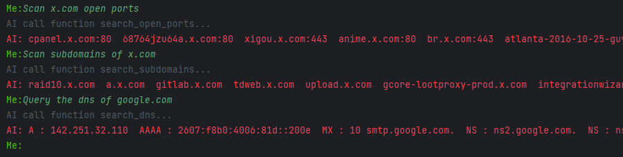
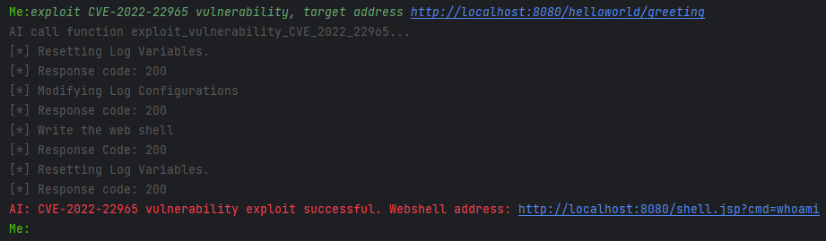
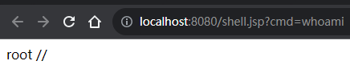
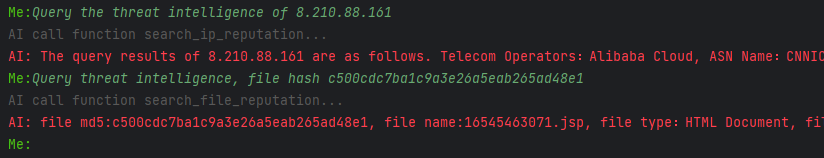
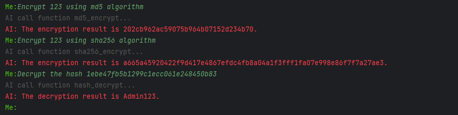
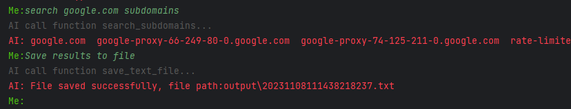

# ChatGPT-Function-Call-Red-Team-Tool
A red team sample tool using ChatGPT function call API. 
## Motivation
There are many example codes for ChatGPT function call api on the Internet, but the integration with specific businesses is not strong, which brings inconvenience to developers, including the integration with network attack and defense business codes, so I wrote a red team sample tool that uses the ChatGPT function call. For reference by developers.
## Features
Supports sending attack and defense requirements to ChatGPT in natural language, ChatGPT uses function call api to automatically do the following:
- [x] Automatically collect target information: scan ports, collect subdomain names, collect DNS records.

- [x] Automatically exploit vulnerabilities: Currently, it supports exploiting the CVE-2022-22965 vulnerability and returns the exploit results. If the exploit is successful, the webshell address will be returned.

<div align=center>

 </div>
- [x] Automatic analysis of intelligence: currently supports querying the reputation information of target IP and backdoor files.

- [x] Automatic encryption and decryption: supports decryption of common hash ciphertexts and hash operations on plaintexts.

- [x] Automatic file generation: currently supports saving ChatGPT’s answer as text file.

## Installation
1. Install dependent packages:
```bash
git clone https://github.com/magicming200/ChatGPT-Function-Call-Red-Team-Tool.git
cd ChatGPT-Function-Call-Red-Team-Tool
pip install -r requirements.txt
```
2. Fill in the ChatGPT key, open /config/system_config.py:
```python
api_chatgpt_key = '<YOUR_API_KEY>'
```
3. Fill in the red team tool api key, open /config/system_config.py:
```python
# hash decryption api：
api_decrypt_email = '<YOUR_API_EMAIL>'
api_decrypt_key = '<YOUR_API_KEY>'
# ports scan api：
api_ports_email = '<YOUR_API_EMAIL>'
api_ports_key = '<YOUR_API_KEY>'
# threat intelligence api：
api_reputation_key = '<YOUR_API_KEY>'
```
## Usage
```bash
 python .\ChatGPT_Function_Call.py
```
